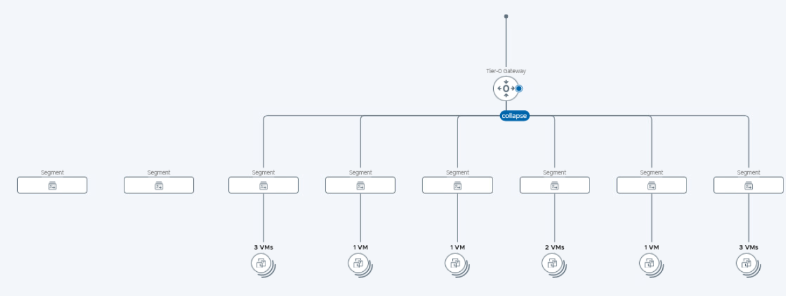

# VMware NSX - Networking Fundamentals Lab Summary

This repository contains a walkthrough and command outputs from the **VMware NSX Networking Fundamentals Hands-on Lab (HOL-2540-01-VCF-L)**.

---

## **Lab Overview**
The lab covers:
- Navigating vSphere and VM console access
- Basic network connectivity checks
- Viewing IP routes
- Analyzing lab network topology

The lab environment consists of multiple clusters, hosts, and NSX Edge nodes configured in a Tier-0 Gateway with multiple segments.



---

## **Steps Performed**

### 1. **Access the Target VM**
- From the **Management Console**, navigated to the `ny-web-01a` VM.
- Opened the web console to access the Photon OS VM.

**Login Credentials Used:**
```bash
Username: root
Password: VMware1!
```

---

### 2. **Check Connectivity to Another Host**
We tested network path to `172.16.20.11` using `tracepath`:

```bash
tracepath 172.16.20.11
```
**Output:**
```
1:  [LOCALHOST] pmtu 1500
1:  ???                               0.852ms asymm 64
2:  ???                               0.581ms asymm 64
     1.920ms reached
Resume: pmtu 1500 hops 2 back 2
```

---

### 3. **Check Routing Table**
We verified the routing table with:
```bash
ip route
```
**Output:**
```
default via 172.16.110.1 dev eth0 proto static
172.16.110.0/24 dev eth0 proto kernel scope link src 172.16.110.11
```

This confirms the default gateway (`172.16.110.1`) and local subnet.

---

### 4. **DNS Check (Skipped)**
Attempted DNS resolution but skipped due to missing package:
```bash
nslookup google.com
# Command not found
```
Tried installing package:
```bash
tdnf install bindutils
```
But package was unavailable in lab environment.

---

### 5. **Lab Network Topology**
The lab uses:
- **Tier-0 Gateway** with multiple Segments
- Each Segment contains 1-3 VMs
- NSX Edges handle routing between segments and upstream

(See `network_topology.png` for diagram)

---

## **Key Learnings**
- How to navigate VMware Hands-on Labs
- How to access VM consoles and log in
- Basic Linux networking commands (`tracepath`, `ip route`)
- Reading and interpreting network topology diagrams in NSX
- Understanding lab resource limitations vs. production environments

---

## **Next Steps**
In a production NSX environment, further steps would include:
- Configuring firewall rules between segments
- Setting up Tier-1 Gateways
- Testing failover between Edge nodes
- Enabling DNS and NTP services

---

*Author:* Gabi Conceicao  
*Date:* August 2025

